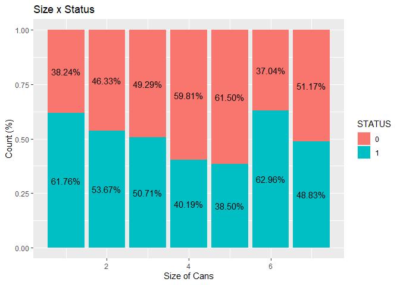
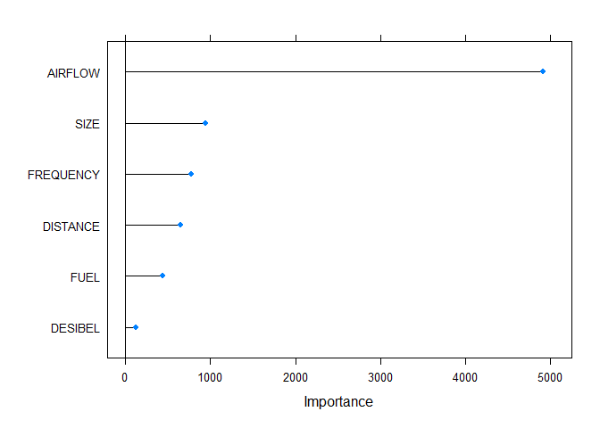

# Prediction of Fire Extinguishing System Functionality

**This is part of the first training course of https://www.datascienceacademy.com.br/ Data Scientist program.**

 

# Definition

In order to **predict the functionality status of acoustic fire extinguishers**, it was asked to create a machine learning model based on different features.

# Dataset

The dataset was obtained as a result of the extinguishing tests of four different fuel flames with a sound wave extinguishing system.

| **Feature Name** | **Description**                                                    |
|------------------|--------------------------------------------------------------------|
| **SIZE**         | Sizes of liquid fuel cans used to achieve different size of flames |
| **FUEL**         | Three different liquid fuels and LPG fuel used to create the flame |
| **DISTANCE**     | Distance of the fuel container from the extinguisher (cm)          |
| **DESIBEL**      | Desibel of the acoustic fire extinguisher (dB)                     |
| **AIRFLOW**      | Airflow of the acoustic fire extinguisher (m/s)                    |
| **FREQUENCY**    | Frequency sound waves of the fire extinguisher (Hz)                |
| **STATUS**       | 0 indicates non-extinction state, 1 indicates the extinction state |

# Exploratory analysis

* Relation between `FREQUENCY` and `AIRFLOW` categorized by `STATUS` of extinguishing

 

We can see that there is a slight negative correlation between `AIRFLOW` and `FREQUENCY` and that **the highest the `AIRFLOW`, the highest the probability of a positive `STATUS`**.

* Relation between `DISTANCE` and `AIRFLOW` categorized by `STATUS` of extinguishing

 

There is a positive correlation between `DESIBEL` and `FREQUENCY` but we **can't identify a clear tendency between these features regarding the `STATUS`**.

* Relation between `DISTANCE` and `AIRFLOW` categorized by `STATUS` of extinguishing

 

As expected, there is a strong negative correlation between `AIRFLOW`and `DISTANCE`. Again, **we observe the tendency of positive `STATUS`for higher `AIRFLOW` condition**.

* Histogram and Boxplot of `DESIBEL`

 

Both, the Histogram and the Boxplot, are relatively similar for the two types of `STATUS`, indicating that the feature **`DESIBEL` might not be a good predictor**.

* Histogram and Boxplot of `AIRFLOW`

 

It is possible to observe again the **differentiation between the `STATUS` of the extinguishers according to the level of `AIRFLOW`**.

* Histogram and Boxplot of `FREQUENCY`

 

Although the Histogram of the feature `FREQUENCY`does not show a clear difference in pattern between the `STATUS`, the Boxplot indicates that **lower `FREQUENCY` data are associated to positive `STATUS`**.

*  Relation between `FUEL` and `STATUS` of extinguishing

 

It seems that the feature `FUEL` has **less effect on the `STATUS` of the fire extinguishers**.

* Relation between `SIZE` and `STATUS` of extinguishing

 

The feature `SIZE` has negative correlation with `STATUS` and seems to be a **good predictor for this feature**.

# Choosing and training the models

For our classification project, we decided to test the following machine learning models: **Nayve Bayes**, **Logistic Regression**, **Random Forest** and **Adaboost**.

For our first running, we will consider all the predictor features from the dataset, which will trained across a 5-fold-cross validation method (in order to avoid randomness of evaluation). Since the range among the features is relatively similar, we opted to **not normalize or scale** the data.

# Evaluating the models

Our main objective for this project is to deliver a model that will be used to predict if a certain acoustic fire extinguisher is able to work properly.

In this case, we are concerned in reducing the false positives or in other words, to maximize the **Precision** metric. We will make use of the Confusion Matrix for this purpose.

According to the results and the previously criteria for this project, we decided to follow with the **Random Forest** model.

# Ranking features by importance

 

As we could previously observe in our exploratory analysis, the feature `DESIBEL` has a smaller effect on the prediction model. For this reason, we will not consider it in our final model.

# Optimizing the chosen model

For our last step, we will train our final prediction model and evaluate its response.

We were able to slight improve our **Precision** metric and achieved a value of **96.9%**. The model is now ready to be deployed to operational usage.
