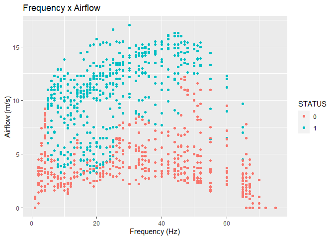
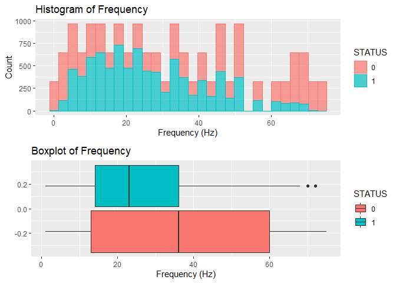

Prediction of Fire Extinguishing System Functionality
================
Fabiano Manetti


# 1. Definition

In order to **predict the functionality status of acoustic fire
extinguisher**, it was asked to create a machine learning model based on
different features.

# 2. Dataset

The dataset was obtained as a result of the extinguishing tests of four
different fuel flames with a sound wave extinguishing system.

| **Feature Name** | **Description**                                                    |
|------------------|--------------------------------------------------------------------|
| **SIZE**         | Sizes of liquid fuel cans used to achieve different size of flames |
| **FUEL**         | Three different liquid fuels and LPG fuel used to create the flame |
| **DISTANCE**     | Distance of the fuel container from the extinguisher (cm)          |
| **DESIBEL**      | Desibel of the acoustic fire extinguisher (dB)                     |
| **AIRFLOW**      | Airflow of the acoustic fire extinguisher (m/s)                    |
| **FREQUENCY**    | Frequency sound waves of the fire extinguisher (Hz)                |
| **STATUS**       | 0 indicates non-extinction state, 1 indicates the extinction state |

# 3. Setting working directory

``` r
setwd("C:/Users/fabiano/OneDrive/Área de Trabalho/Arquivos/Data_Science/DSA/Big_Data_R_Azure/fire_extinguishing_prediction")
getwd()
```

    ## [1] "C:/Users/fabiano/OneDrive/Área de Trabalho/Arquivos/Data_Science/DSA/Big_Data_R_Azure/fire_extinguishing_prediction"

# 4. Importing libraries

``` r
library(readxl, quietly = T)
library(ggplot2, quietly = T)
library(dplyr, quietly = T)
library(corrplot, quietly = T)
library(caTools, quietly = T)
library(caret, quietly = T)
library(gridExtra, quietly = T)
```

# 5. Reading the dataset

``` r
dataset <- read_excel('Acoustic_Extinguisher_Fire_Dataset.xlsx', sheet = 'A_E_Fire_Dataset')
```

``` r
sample(dataset)
```

    ## # A tibble: 17,442 × 7
    ##     SIZE DESIBEL STATUS FUEL     AIRFLOW DISTANCE FREQUENCY
    ##    <dbl>   <dbl>  <dbl> <chr>      <dbl>    <dbl>     <dbl>
    ##  1     1      96      0 gasoline     0         10        75
    ##  2     1      96      1 gasoline     0         10        72
    ##  3     1      96      1 gasoline     2.6       10        70
    ##  4     1      96      1 gasoline     3.2       10        68
    ##  5     1     109      1 gasoline     4.5       10        67
    ##  6     1     109      1 gasoline     7.8       10        66
    ##  7     1     103      1 gasoline     9.7       10        65
    ##  8     1      95      1 gasoline    12         10        60
    ##  9     1     102      1 gasoline    13.3       10        55
    ## 10     1      93      1 gasoline    15.4       10        52
    ## # … with 17,432 more rows

# 6. Exploratory analysis

## 6.1 Summary

``` r
dim(dataset)
```

    ## [1] 17442     7

``` r
str(dataset)
```

    ## tibble [17,442 × 7] (S3: tbl_df/tbl/data.frame)
    ##  $ SIZE     : num [1:17442] 1 1 1 1 1 1 1 1 1 1 ...
    ##  $ FUEL     : chr [1:17442] "gasoline" "gasoline" "gasoline" "gasoline" ...
    ##  $ DISTANCE : num [1:17442] 10 10 10 10 10 10 10 10 10 10 ...
    ##  $ DESIBEL  : num [1:17442] 96 96 96 96 109 109 103 95 102 93 ...
    ##  $ AIRFLOW  : num [1:17442] 0 0 2.6 3.2 4.5 7.8 9.7 12 13.3 15.4 ...
    ##  $ FREQUENCY: num [1:17442] 75 72 70 68 67 66 65 60 55 52 ...
    ##  $ STATUS   : num [1:17442] 0 1 1 1 1 1 1 1 1 1 ...

``` r
class(dataset)
```

    ## [1] "tbl_df"     "tbl"        "data.frame"

``` r
summary(dataset)
```

    ##       SIZE           FUEL              DISTANCE      DESIBEL      
    ##  Min.   :1.000   Length:17442       Min.   : 10   Min.   : 72.00  
    ##  1st Qu.:2.000   Class :character   1st Qu.: 50   1st Qu.: 90.00  
    ##  Median :3.000   Mode  :character   Median :100   Median : 95.00  
    ##  Mean   :3.412                      Mean   :100   Mean   : 96.38  
    ##  3rd Qu.:5.000                      3rd Qu.:150   3rd Qu.:104.00  
    ##  Max.   :7.000                      Max.   :190   Max.   :113.00  
    ##     AIRFLOW         FREQUENCY         STATUS      
    ##  Min.   : 0.000   Min.   : 1.00   Min.   :0.0000  
    ##  1st Qu.: 3.200   1st Qu.:14.00   1st Qu.:0.0000  
    ##  Median : 5.800   Median :27.50   Median :0.0000  
    ##  Mean   : 6.976   Mean   :31.61   Mean   :0.4978  
    ##  3rd Qu.:11.200   3rd Qu.:47.00   3rd Qu.:1.0000  
    ##  Max.   :17.000   Max.   :75.00   Max.   :1.0000

## 6.2 Unique values

``` r
table(dataset$STATUS)
```

    ## 
    ##    0    1 
    ## 8759 8683

``` r
table(dataset$SIZE)
```

    ## 
    ##    1    2    3    4    5    6    7 
    ## 3078 3078 3078 3078 3078 1026 1026

``` r
table(dataset$FUEL)
```

    ## 
    ## gasoline kerosene      lpg  thinner 
    ##     5130     5130     2052     5130

``` r
table(dataset$DISTANCE)
```

    ## 
    ##  10  20  30  40  50  60  70  80  90 100 110 120 130 140 150 160 170 180 190 
    ## 918 918 918 918 918 918 918 918 918 918 918 918 918 918 918 918 918 918 918

``` r
table(dataset$DESIBEL)
```

    ## 
    ##   72   74   75   76   78   79   80   82   83   84   85   86   87   88   89   90 
    ##   17  119  136   51   85   51  119   34   85  119  238  442  425  561  782 1105 
    ##   91   92   93   94   95   96   97   98   99  100  101  102  103  104  105  106 
    ##  969 1462  765  646  765 1360  272   51   34  119  255  612  595  867 1071 1360 
    ##  107  108  109  110  111  112  113 
    ##  612  646  187  272  102   34   17

``` r
table(dataset$AIRFLOW)
```

    ## 
    ##    0  0.4  0.8    1  1.1  1.3  1.4  1.5  1.6  1.7  1.9    2  2.1  2.2  2.3  2.5 
    ## 1632   51   34   85   34   68  102  119  102   51  102  153  136  255  170  221 
    ##  2.6  2.7  2.8  2.9    3  3.1  3.2  3.3  3.4  3.6  3.7  3.8  3.9    4  4.2  4.3 
    ##  153  221  255  204   17  187  357  238  289  187  374  153  119  238  306  136 
    ##  4.4  4.5  4.6  4.8  4.9    5  5.2  5.3  5.4  5.6  5.7  5.8    6  6.1  6.3  6.4 
    ##  238  238  102  170  119  221  187  119   68  204  187  153  136   85   85   85 
    ##  6.5  6.7  6.8    7  7.1  7.2  7.3  7.4  7.5  7.7  7.8  7.9  8.1  8.2  8.3  8.5 
    ##  221   51   51  153   51   34   17  119  153  119  102  102   51   68   68  136 
    ##  8.6  8.7  8.8  8.9    9  9.1  9.2  9.3  9.5  9.6  9.7  9.9   10 10.2 10.3 10.4 
    ##   85   17  102   34   85   17   85  136  136   51  102   68  238  119  187  102 
    ## 10.5 10.6 10.7 10.9   11 11.2 11.3 11.5 11.6 11.8 11.9   12 12.2 12.3 12.5 12.6 
    ##   51  187  119  153  306  153  119  204  136   51  119  255  136  272  255  102 
    ## 12.8 12.9   13 13.1 13.2 13.3 13.4 13.5 13.6 13.8 13.9   14 14.1 14.2 14.3 14.4 
    ##   68  102   34   34  153  136   17  204   68  136   34   17   85  136   17  204 
    ## 14.5 14.6 14.8 14.9   15 15.1 15.2 15.4 15.5 15.7   16 16.1 16.3 16.6   17 
    ##  102   34   85  153   34   51  255  136  102   34  102   17   34   17   17

``` r
table(dataset$FREQUENCY)
```

    ## 
    ##   1   2   3   4   5   6   7   8   9  10  11  12  13  14  15  16  17  18  19  20 
    ## 323 323 323 323 323 323 323 323 323 323 323 323 323 323 323 323 323 323 323 323 
    ##  21  22  23  24  25  26  27  28  30  32  33  34  35  36  38  40  42  44  45  46 
    ## 323 323 323 323 323 323 323 323 323 323 323 323 323 323 323 323 323 323 323 323 
    ##  47  48  50  51  52  55  60  65  66  67  68  70  72  75 
    ## 323 323 323 323 323 323 323 323 323 323 323 323 323 323

## 6.3 Transforming the Columns `STATUS` and `FUEL` from character to factor

Let’s transform the two categorical features `STATUS` and `FUEL` into
factor variables:

``` r
dataset$STATUS <- as.factor(dataset$STATUS)
dataset$FUEL <- as.factor(dataset$FUEL)

str(dataset)
```

    ## tibble [17,442 × 7] (S3: tbl_df/tbl/data.frame)
    ##  $ SIZE     : num [1:17442] 1 1 1 1 1 1 1 1 1 1 ...
    ##  $ FUEL     : Factor w/ 4 levels "gasoline","kerosene",..: 1 1 1 1 1 1 1 1 1 1 ...
    ##  $ DISTANCE : num [1:17442] 10 10 10 10 10 10 10 10 10 10 ...
    ##  $ DESIBEL  : num [1:17442] 96 96 96 96 109 109 103 95 102 93 ...
    ##  $ AIRFLOW  : num [1:17442] 0 0 2.6 3.2 4.5 7.8 9.7 12 13.3 15.4 ...
    ##  $ FREQUENCY: num [1:17442] 75 72 70 68 67 66 65 60 55 52 ...
    ##  $ STATUS   : Factor w/ 2 levels "0","1": 1 2 2 2 2 2 2 2 2 2 ...

## 6.4 Changing levels of `FUEL` (1 - gasoline, 2 - kerosene, 3 - lpg, 4 - thinner)

Some of the machine learning models require numeric values for the
features. Hence, we need to convert the feature `FUEL` in a numeric
variable:

``` r
levels(dataset$FUEL)[1] <- 1
levels(dataset$FUEL)[2] <- 2
levels(dataset$FUEL)[3] <- 3
levels(dataset$FUEL)[4] <- 4

str(dataset)
```

    ## tibble [17,442 × 7] (S3: tbl_df/tbl/data.frame)
    ##  $ SIZE     : num [1:17442] 1 1 1 1 1 1 1 1 1 1 ...
    ##  $ FUEL     : Factor w/ 4 levels "1","2","3","4": 1 1 1 1 1 1 1 1 1 1 ...
    ##  $ DISTANCE : num [1:17442] 10 10 10 10 10 10 10 10 10 10 ...
    ##  $ DESIBEL  : num [1:17442] 96 96 96 96 109 109 103 95 102 93 ...
    ##  $ AIRFLOW  : num [1:17442] 0 0 2.6 3.2 4.5 7.8 9.7 12 13.3 15.4 ...
    ##  $ FREQUENCY: num [1:17442] 75 72 70 68 67 66 65 60 55 52 ...
    ##  $ STATUS   : Factor w/ 2 levels "0","1": 1 2 2 2 2 2 2 2 2 2 ...

## 6.5 Checking for missing values

``` r
column_names <- colnames(dataset)

missing_values <- c()

for (column in column_names){
  missing_values[column] <- sum(is.na(dataset[column]))
}

missing_values
```

    ##      SIZE      FUEL  DISTANCE   DESIBEL   AIRFLOW FREQUENCY    STATUS 
    ##         0         0         0         0         0         0         0

We don’t have **missing values**, so there’s no need to any
transformation in the data.

## 6.6 Graph analysis

- Relation between `FREQUENCY` and `AIRFLOW` categorized by `STATUS` of
  extinguishing

``` r
ggplot(dataset, aes(x = FREQUENCY, y = AIRFLOW, colour = STATUS)) + geom_point() +
  labs(title = "Frequency x Airflow", x = "Frequency (Hz)", y = "Airflow (m/s)")
```

<!-- -->

We can see that there is a slight negative correlation between `AIRFLOW`
and `FREQUENCY` and that **the higher the `AIRFLOW`, the higher the
probability of a positive `STATUS`**.

- Relation between `FREQUENCY` and `DESIBEL` categorized by `STATUS` of
  extinguishing

``` r
ggplot(dataset, aes(x = FREQUENCY, y = DESIBEL, colour = STATUS)) + geom_point() +
  labs(title = "Frequency x Desibel", x = "Frequency (Hz)", y = "Desibel (dB)")
```

<!-- -->

There is a positive correlation between `DESIBEL` and `FREQUENCY` but we
**can’t identify a clear tendency between these features regarding the
`STATUS`**.

- Relation between `DISTANCE` and `AIRFLOW` categorized by `STATUS` of
  extinguishing

``` r
ggplot(dataset, aes(x = DISTANCE, y = AIRFLOW, colour = STATUS)) + geom_point() +
  labs(title = "Distance x Airflow", x = "Distance (cm)", y = "Airflow (m/s)")
```

<!-- -->

As expected, there is a strong negative correlation between `AIRFLOW`and
`DISTANCE`. Again, **we observe the tendency of positive `STATUS`for
higher `AIRFLOW` condition**.

- Histogram and Boxplot of `DESIBEL`

``` r
plot1 <- ggplot(dataset, aes(x = DESIBEL, fill = STATUS, colour = STATUS), binwidth = 30) +
  geom_histogram(alpha = 0.7, bins=30) + 
  labs(title = "Histogram of Desibel", x = "Desibel (dB)", y = "Count")

plot2 <- ggplot(dataset, aes(x = DESIBEL, fill = STATUS)) +
  geom_boxplot() + 
  labs(title = "Boxplot of Desibel", x = "Desibel (dB)", y = "")

grid.arrange(plot1, plot2, ncol = 1)
```

<!-- -->

Both, the Histogram and the Boxplot, are relatively similar for the two
types of `STATUS`, indicating that the feature **`DESIBEL` might not be
a good predictor**.

- Histogram and Boxplot of `AIRFLOW`

``` r
plot1 <- ggplot(dataset, aes(x = AIRFLOW, fill = STATUS, colour = STATUS), binwidth = 30) +
  geom_histogram(alpha = 0.7, bins=30) +
  labs(title = "Histogram of Airflow", x = "Airflow (m/s)", y = "Count")

plot2 <- ggplot(dataset, aes(x = AIRFLOW, fill = STATUS)) +
  geom_boxplot() + 
  labs(title = "Boxplot of Aiflow", x = "Airflow (m/s)", y = "")

grid.arrange(plot1, plot2, ncol = 1)
```

<!-- -->

It is possible to observe again the **differentiation between the
`STATUS` of the extinguishers according to the level of `AIRFLOW`**.

- Histogram and Boxplot of `FREQUENCY`

``` r
plot1 <- ggplot(dataset, aes(x = FREQUENCY, fill = STATUS, colour = STATUS), binwidth = 30) +
  geom_histogram(alpha = 0.7, bins=30) +
  labs(title = "Histogram of Frequency", x = "Frequency (Hz)", y = "Count")

plot2 <- ggplot(dataset, aes(x = FREQUENCY, fill = STATUS)) +
  geom_boxplot() + 
  labs(title = "Boxplot of Frequency", x = "Frequency (Hz)", y = "")

grid.arrange(plot1, plot2, ncol = 1)
```

<!-- -->

Although the Histogram of the feature `FREQUENCY`does not show a clear
difference in pattern between the `STATUS`, the Boxplot indicates that
**lower `FREQUENCY` data are associated to positive `STATUS`**.

- Relation between `FUEL` and `STATUS` of extinguishing

``` r
df_sum_fuel <- dataset %>%
  group_by(FUEL, STATUS)%>%
  summarise(Freq = sum(as.integer(FUEL)))%>%
  mutate(Prop = Freq / sum(Freq))

ggplot(df_sum_fuel, aes(x = FUEL, y = Prop, fill = STATUS)) + geom_col() + 
  geom_text(aes(label = scales::percent(Prop)), position = position_stack(.5)) +
  labs(title = "Fuel x Status", x = "Type of Fuel", y = "Count (%)")
```

<!-- -->

It seems that the feature `FUEL` has **less effect on the `STATUS` of
the fire extinguishers**.

- Relation between `SIZE` and `STATUS` of extinguishing

``` r
df_sum_size <- dataset %>%
  group_by(SIZE, STATUS)%>%
  summarise(Freq = sum(SIZE))%>%
  mutate(Prop = Freq / sum(Freq))

ggplot(df_sum_size, aes(x = SIZE, y = Prop, fill = STATUS)) + geom_col() + 
  geom_text(aes(label = scales::percent(Prop)), position = position_stack(.5)) +
  labs(title = "Size x Status", x = "Size of Cans", y = "Count (%)")
```

<!-- -->

The feature `SIZE` has negative correlation with `STATUS` and seems to
be a **good predictor for this feature**.

## 6.7 Feature correlation

We can now visualize a matrix containing the correlation among all
features. When the level of significance is less than 5% we chose to
omit the corresponding correlation.

``` r
dataset$STATUS <- as.integer(dataset$STATUS)
dataset$FUEL <- as.integer(dataset$FUEL)

dataset$STATUS <- replace(dataset$STATUS, dataset$STATUS == 1, 0)
dataset$STATUS <- replace(dataset$STATUS, dataset$STATUS == 2, 1)

matrix_correlation<-cor(dataset)

cor.mtest <- function(mat, ...) {
  mat <- as.matrix(mat)
  n <- ncol(mat)
  p.mat<- matrix(NA, n, n)
  diag(p.mat) <- 0
  for (i in 1:(n - 1)) {
    for (j in (i + 1):n) {
      tmp <- cor.test(mat[, i], mat[, j], ...)
      p.mat[i, j] <- p.mat[j, i] <- tmp$p.value
    }
  }
  colnames(p.mat) <- rownames(p.mat) <- colnames(mat)
  p.mat
}

p.mat <- cor.mtest(dataset)

col <- colorRampPalette(c("#BB4444", "#EE9988", "#FFFFFF", "#77AADD", "#4477AA"))

corrplot(matrix_correlation, method="color", col=col(200),  
         type="upper", order="hclust", 
         addCoef.col = "black",
         tl.col="black", tl.srt=90, 
         p.mat = p.mat, sig.level = 0.05, insig = "blank", 
         diag=TRUE)
```

<!-- -->

# 7. Creating predictive models

## 7.1 Spliting for final test set

``` r
set.seed(45)

sample <- sample.split(dataset$STATUS, SplitRatio = 0.9)
train_validation  <- subset(dataset, sample == TRUE)
test   <- subset(dataset, sample == FALSE)
```

``` r
dim(dataset)
```

    ## [1] 17442     7

``` r
dim(train_validation)
```

    ## [1] 15698     7

``` r
dim(test)
```

    ## [1] 1744    7

## 7.2 Choosing and training the models

For our classification project, we decided to test the following machine
learning models: **Nayve Bayes**, **Logistic Regression**, **Random
Forest** and **Adaboost**.

For our first running, we will consider all the predictor features from
the dataset, which will trained across a 5-fold-cross validation method
(in order to avoid randomness of evaluation). Since the range among the
features is relatively similar, we opted to **not normalize or scale**
the data.

``` r
models = c("naive_bayes", "LogitBoost", "rf", "ada")

model_trained <- c()

set.seed(45) 

train.control <- trainControl(method = "cv", number = 5)

for (model in models){
  model_trained[[model]] <- train(as.factor(STATUS) ~ ., data = train_validation, 
                                method = model,
                                trControl = train.control,
                                metric = 'Accuracy')
}
```

## 7.3 Evaluating the models

Our main objective for this project is to deliver a model that will be
used to predict if a certain acoustic fire extinguisher is able to work
properly.

In this case, we are concerned in reducing the false positives or in
other words, to maximize the **Precision** metric. We will make use of
the Confusion Matrix for this purpose.

``` r
predict_models <- predict(model_trained, newdata = test)

for (model in predict_models){
  print(confusionMatrix(data = model, reference = as.factor(test$STATUS), 
                  positive = "1", mode = "prec_recall"))
  print("------------------------------------------------------------------------------")
}
```

    ## Confusion Matrix and Statistics
    ## 
    ##           Reference
    ## Prediction   0   1
    ##          0 786 119
    ##          1  90 749
    ##                                         
    ##                Accuracy : 0.8802        
    ##                  95% CI : (0.864, 0.895)
    ##     No Information Rate : 0.5023        
    ##     P-Value [Acc > NIR] : < 2e-16       
    ##                                         
    ##                   Kappa : 0.7603        
    ##                                         
    ##  Mcnemar's Test P-Value : 0.05277       
    ##                                         
    ##               Precision : 0.8927        
    ##                  Recall : 0.8629        
    ##                      F1 : 0.8776        
    ##              Prevalence : 0.4977        
    ##          Detection Rate : 0.4295        
    ##    Detection Prevalence : 0.4811        
    ##       Balanced Accuracy : 0.8801        
    ##                                         
    ##        'Positive' Class : 1             
    ##                                         
    ## [1] "------------------------------------------------------------------------------"
    ## Confusion Matrix and Statistics
    ## 
    ##           Reference
    ## Prediction   0   1
    ##          0 808  65
    ##          1  68 803
    ##                                           
    ##                Accuracy : 0.9237          
    ##                  95% CI : (0.9103, 0.9358)
    ##     No Information Rate : 0.5023          
    ##     P-Value [Acc > NIR] : <2e-16          
    ##                                           
    ##                   Kappa : 0.8475          
    ##                                           
    ##  Mcnemar's Test P-Value : 0.8623          
    ##                                           
    ##               Precision : 0.9219          
    ##                  Recall : 0.9251          
    ##                      F1 : 0.9235          
    ##              Prevalence : 0.4977          
    ##          Detection Rate : 0.4604          
    ##    Detection Prevalence : 0.4994          
    ##       Balanced Accuracy : 0.9237          
    ##                                           
    ##        'Positive' Class : 1               
    ##                                           
    ## [1] "------------------------------------------------------------------------------"
    ## Confusion Matrix and Statistics
    ## 
    ##           Reference
    ## Prediction   0   1
    ##          0 847  17
    ##          1  29 851
    ##                                          
    ##                Accuracy : 0.9736         
    ##                  95% CI : (0.965, 0.9806)
    ##     No Information Rate : 0.5023         
    ##     P-Value [Acc > NIR] : <2e-16         
    ##                                          
    ##                   Kappa : 0.9472         
    ##                                          
    ##  Mcnemar's Test P-Value : 0.1048         
    ##                                          
    ##               Precision : 0.9670         
    ##                  Recall : 0.9804         
    ##                      F1 : 0.9737         
    ##              Prevalence : 0.4977         
    ##          Detection Rate : 0.4880         
    ##    Detection Prevalence : 0.5046         
    ##       Balanced Accuracy : 0.9737         
    ##                                          
    ##        'Positive' Class : 1              
    ##                                          
    ## [1] "------------------------------------------------------------------------------"
    ## Confusion Matrix and Statistics
    ## 
    ##           Reference
    ## Prediction   0   1
    ##          0 814  69
    ##          1  62 799
    ##                                           
    ##                Accuracy : 0.9249          
    ##                  95% CI : (0.9115, 0.9368)
    ##     No Information Rate : 0.5023          
    ##     P-Value [Acc > NIR] : <2e-16          
    ##                                           
    ##                   Kappa : 0.8498          
    ##                                           
    ##  Mcnemar's Test P-Value : 0.6001          
    ##                                           
    ##               Precision : 0.9280          
    ##                  Recall : 0.9205          
    ##                      F1 : 0.9242          
    ##              Prevalence : 0.4977          
    ##          Detection Rate : 0.4581          
    ##    Detection Prevalence : 0.4937          
    ##       Balanced Accuracy : 0.9249          
    ##                                           
    ##        'Positive' Class : 1               
    ##                                           
    ## [1] "------------------------------------------------------------------------------"

According to the results and the previously criteria for this project,
we decided to follow with the **Random Forest** model.

## 7.4 Ranking features by importance

It is interesting now to evaluate wich features affect most our
prediction model, and eventually discard some.

``` r
chosen_model <- train(as.factor(STATUS) ~ ., data = train_validation, 
                     method = "rf",
                     trControl = train.control,
                     metric = 'Accuracy')

importance <- varImp(chosen_model, scale=FALSE)

plot(importance)
```

<!-- -->

As we could previously observe in our exploratory analysis, the feature
`DESIBEL` has a smaller effect on the prediction model. For this reason,
we will not consider it in our final model.

## 7.5 Optimizing the chosen model

For our last step, we will train our final prediction model and evaluate
its response.

``` r
final_model <- train(as.factor(STATUS) ~ AIRFLOW + SIZE + FREQUENCY + DISTANCE + FUEL, 
               data = train_validation, 
               method = "rf",
               trControl = train.control,
               metric = 'Accuracy')
final_model
```

    ## Random Forest 
    ## 
    ## 15698 samples
    ##     5 predictor
    ##     2 classes: '0', '1' 
    ## 
    ## No pre-processing
    ## Resampling: Cross-Validated (5 fold) 
    ## Summary of sample sizes: 12558, 12558, 12559, 12558, 12559 
    ## Resampling results across tuning parameters:
    ## 
    ##   mtry  Accuracy   Kappa    
    ##   2     0.9687223  0.9374425
    ##   3     0.9716527  0.9433040
    ##   5     0.9738822  0.9477638
    ## 
    ## Accuracy was used to select the optimal model using the largest value.
    ## The final value used for the model was mtry = 5.

``` r
final_prediction <- predict(final_model, newdata = test)

confusionMatrix(data = final_prediction, reference = as.factor(test$STATUS), 
                positive = "1", mode = "prec_recall")
```

    ## Confusion Matrix and Statistics
    ## 
    ##           Reference
    ## Prediction   0   1
    ##          0 849  14
    ##          1  27 854
    ##                                           
    ##                Accuracy : 0.9765          
    ##                  95% CI : (0.9682, 0.9831)
    ##     No Information Rate : 0.5023          
    ##     P-Value [Acc > NIR] : < 2e-16         
    ##                                           
    ##                   Kappa : 0.953           
    ##                                           
    ##  Mcnemar's Test P-Value : 0.06092         
    ##                                           
    ##               Precision : 0.9694          
    ##                  Recall : 0.9839          
    ##                      F1 : 0.9766          
    ##              Prevalence : 0.4977          
    ##          Detection Rate : 0.4897          
    ##    Detection Prevalence : 0.5052          
    ##       Balanced Accuracy : 0.9765          
    ##                                           
    ##        'Positive' Class : 1               
    ## 

We were able to slight improve our **Precision** metric and achieved a
value of **96.9%**. The model is now ready to be deployed to operational
usage.
